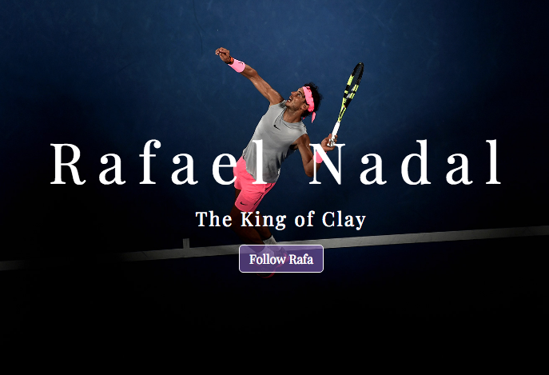

# Rafael Nadal Tribute Page

This project is part of the freeCodeCamp Responsive Web Design Certification.
I was able to review some HTML topics as well as learn new ones along the way.
The main components of this site are the hero image, the timeline section using Bootstrap grid and flexbox, and the footer. I also made use of Google Fonts, Font Awesome icons, and Google Material icons.

The page can be viewed [here](https://htmlpreview.github.io/?https://github.com/andysoto/RafaelNadalTribute/blob/master/index.html).
